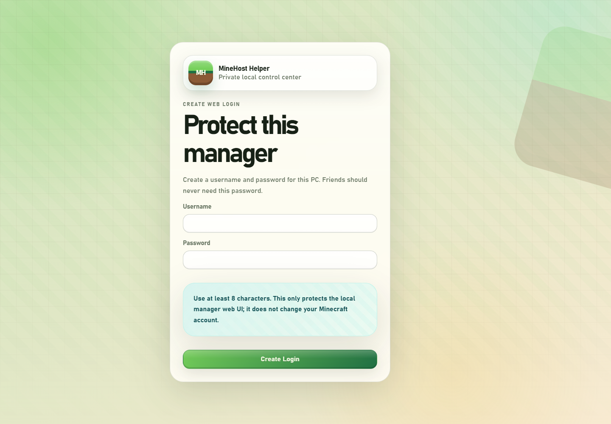
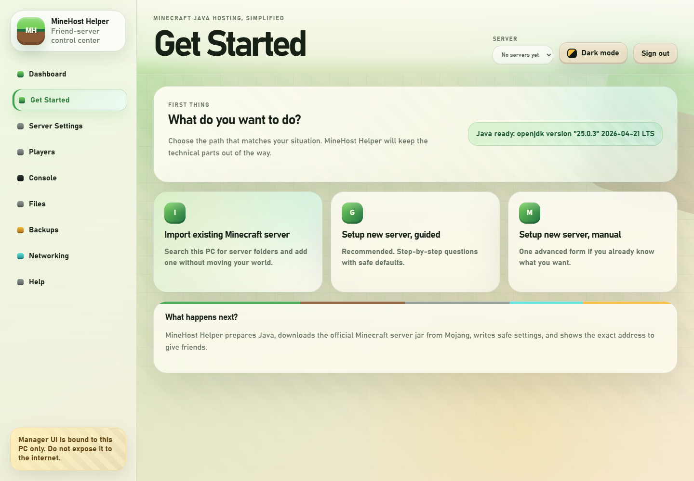
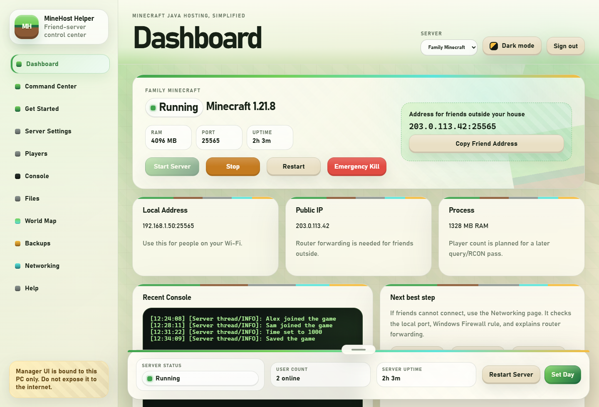
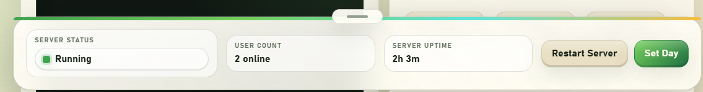
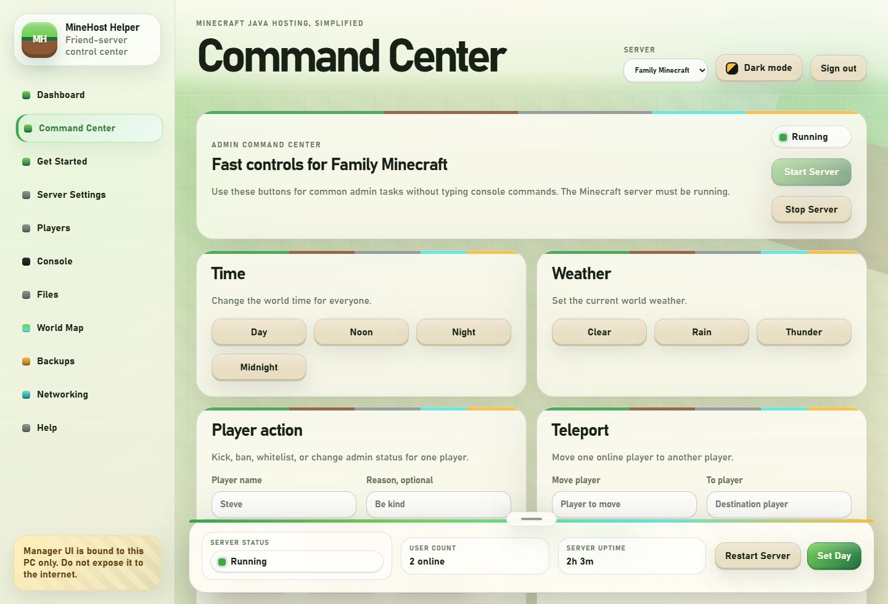
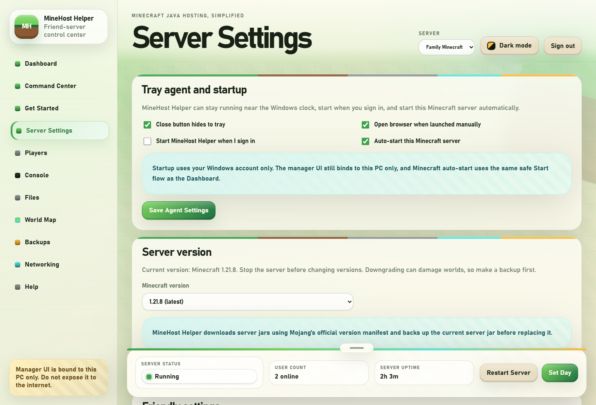
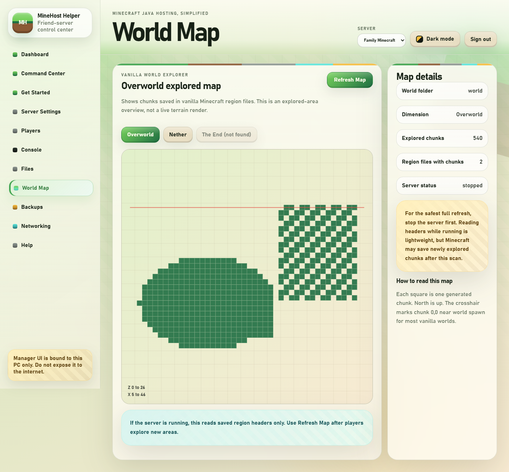
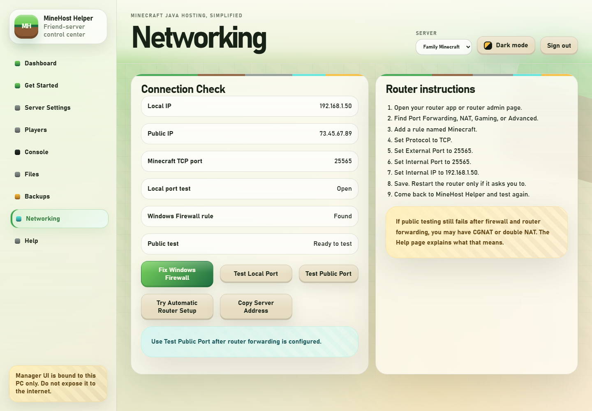
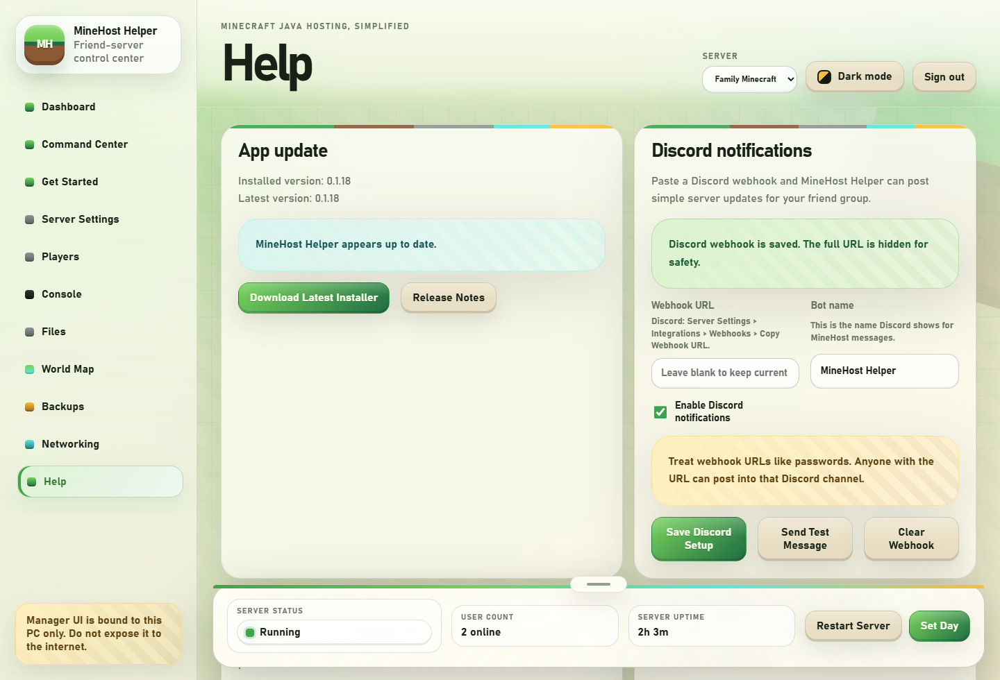

# MineHost Helper

## Download For Windows

**Easy installer for friends:** [Download MineHostHelper-FriendSigned.zip](https://github.com/gosplunk/minehost-helper/releases/latest/download/MineHostHelper-FriendSigned.zip)

This ZIP contains `MineHostHelperSetup-FriendSigned.exe`. Friends should unzip it, run `Install MineHost Helper Friend Publisher Certificate.bat`, approve the Windows prompt, then run `MineHostHelperSetup-FriendSigned.exe`.

**Defender-safe fallback:** [Download MineHostHelper-Portable.zip](https://github.com/gosplunk/minehost-helper/releases/latest/download/MineHostHelper-Portable.zip)

The portable ZIP contains no MineHost Helper `.exe`, which avoids the PyInstaller installer path that Windows Defender may flag on some PCs. Unzip it, then double click `Start MineHost Helper.bat`.

Friend Mode signing is for private friends/family who trust you. It is not public Microsoft code-signing reputation. If Defender blocks the installer with `WinError 225`, use the portable ZIP or submit the exact file to Microsoft as a false positive.

**License:** MineHost Helper is free to install and use, but it is **not open source**. The source is public for transparency. Modified versions, redistributed forks, rebranded builds, and resale are not allowed. See [LICENSE.md](LICENSE.md).

With the portable ZIP, first launch creates a local Python environment, installs MineHost Helper dependencies, creates a local web login, and opens the browser UI. It still checks for Java 25+ and can prepare the bundled Eclipse Temurin Java runtime when Java is missing.

If Windows Defender blocks a release with `WinError 225`, do not disable Defender. See [Windows Defender And SmartScreen](docs/WINDOWS_DEFENDER.md). The fix is to submit the exact flagged file to Microsoft for false-positive review and sign future releases.

If the download link does not work, open the Releases page and download the newest `MineHostHelper-Portable.zip` asset.

MineHost Helper is a Windows-first local web app for running a Minecraft Java server without command-line work after installation. It installs or downloads what it needs, opens a browser UI automatically, creates servers, writes `server.properties`, starts and stops Minecraft, shows logs, creates backups, and guides users through Windows Firewall and router forwarding.

On first launch, the web app opens to a clean Get Started page with three choices: import an existing Minecraft server, create a new server with guided steps, or create a new server manually from one advanced form.

The manager UI binds to `127.0.0.1` by default so only this PC can control it. Do not expose the manager UI to the internet.

## Screenshots

<table>
  <tr>
    <td><strong>Local web login</strong><br></td>
    <td><strong>Get Started</strong><br></td>
  </tr>
  <tr>
    <td><strong>Dashboard</strong><br></td>
    <td><strong>Quick Controls</strong><br></td>
  </tr>
  <tr>
    <td><strong>Command Center</strong><br></td>
    <td><strong>Server Settings</strong><br></td>
  </tr>
  <tr>
    <td><strong>World Map</strong><br></td>
    <td><strong>Networking</strong><br></td>
  </tr>
  <tr>
    <td><strong>Discord Setup</strong><br></td>
    <td></td>
  </tr>
</table>

## Recommended Install For Friends

Until releases are code-signed, use the portable ZIP for friends:

```text
dist-portable\MineHostHelper-Portable.zip
```

Unzip it into a normal writable folder, then double click:

```text
Start MineHost Helper.bat
```

The older installer path remains available for testing, but it is more likely to trigger Defender until releases are signed and cleared by Microsoft:

```text
dist-installer\MineHostHelperSetup.exe
```

For a small private friend group, MineHost Helper also has a self-signed Friend Mode package. It signs the installer with a private certificate and includes a helper for friends to trust that certificate. This is not for public distribution. See [Friend Mode Self-Signed Builds](docs/FRIEND_MODE_SIGNING.md).

The setup app lets the user choose the install folder, create the local web UI username/password, creates shortcuts, registers an uninstaller in Windows Apps & Features, and installs `Uninstall MineHost Helper.exe` into the install folder. If MineHost Helper is already installed, setup offers Update / Repair or Clean Install. Update / Repair detects the existing web login and keeps the same username/password hash by default.

Unsigned EXEs/installers may trigger Windows SmartScreen or Defender false positives. That is expected for early builds; public-friendly releases should be Authenticode signed. Starting with `v0.1.22`, the recommended download is a portable ZIP with no MineHost Helper EXE.

## Run From Source

Use this path for development or portable testing:

1. Copy this folder to a normal writable location, such as `C:\MineHostHelper`.
2. Double click `Start MineHost Helper.bat`.
3. The browser opens automatically at `http://127.0.0.1:48721` or the next free port.

Requirements for source mode:

- Windows 10 or Windows 11.
- Python 3.10 or newer.
- Internet access during install for Eclipse Temurin Java if needed, and on first server creation for Mojang server jars.

If Python is missing, the launcher explains the problem and can ask to install Python with `winget`. If `winget` is not available, install Python from `https://www.python.org/downloads/windows/` and check `Add python.exe to PATH`.

## What First Run Does

- Creates `.venv` in source mode and installs Python dependencies from `requirements.txt`.
- Starts the FastAPI backend on `127.0.0.1`.
- Opens the local web UI and requires the local MineHost Helper username/password.
- Checks for Java 25+ during setup launch and skips Java download when compatible Java already exists.
- Downloads a safe Eclipse Temurin OpenJDK runtime during install only when Java 25+ is missing. Get Started can retry later if the network blocks the Java download.
- Downloads Minecraft server jars from Mojang's official version manifest.
- Keeps app data local to the install/source folder.

Local data folders:

- `app_data/` stores JSON state.
- `servers/` stores Minecraft server folders.
- `backups/` stores zip backups.
- `runtimes/java/` stores downloaded Java runtimes.
- `runtimes/minecraft/` stores downloaded Mojang server jars.
- `logs/` stores manager-side console capture.

## Create A Server

1. Open Get Started.
2. Choose `Setup new server, guided` for the recommended step-by-step path, or `Setup new server, manual` for one advanced form.
3. Choose server name, Minecraft version, RAM, port, world name, gamemode, difficulty, and player options.
4. Read and explicitly accept the Minecraft EULA.
5. Click Create Server.

MineHost Helper downloads the selected server jar using Mojang's official version manifest and verifies SHA1 when Mojang provides it.

## Add An Existing Server

If you already have a Minecraft Java server folder on this PC:

1. Open Get Started.
2. Choose `Import existing Minecraft server`.
3. MineHost Helper scans common folders automatically.
4. Choose Add to MineHost on the server you want.
5. Stop that server if it is already running somewhere else.
6. Start it from the Dashboard.

MineHost Helper looks in common folders such as Desktop, Downloads, Documents, Games, AppData, and `D:\Dev`. It adopts the existing folder in place, so it does not move or delete your world. The folder must contain `server.properties` and a server `.jar`.

## Start, Stop, Restart

Use the Dashboard buttons:

- Start Server launches `java -Xmx<size> -Xms<size> -jar server.jar nogui`.
- Stop sends the Minecraft `stop` command for a graceful shutdown.
- Restart stops and starts again.
- Emergency Kill is only for stuck servers.

MineHost Helper checks whether the configured Minecraft port is already in use before starting and explains the resolution instead of failing later in the Minecraft console.

## Command Center

The Command Center is the fast admin page for common Minecraft server actions. It provides buttons for time, weather, save world, whitelist reload, keep inventory, daylight/weather cycles, announcements, kick/ban/unban, OP/de-OP, and teleporting one player to another. It also shows a quick resource snapshot for PC CPU, memory, disk, Minecraft RAM, server folder size, online players, and recent console output.

Command Center buttons use structured backend command builders instead of running arbitrary shell commands. For advanced Minecraft commands, use the Console page.

## Settings And Tray Agent

Server Settings provides friendly controls for common properties and an advanced key/value editor for everything else. MineHost Helper backs up `server.properties` before overwriting it.

The app can also run as a small Windows tray agent. Optional settings let the user:

- Close the control window to the system tray.
- Start MineHost Helper when Windows starts.
- Automatically start selected Minecraft servers when the app launches.

Start-on-boot uses the current user's `HKCU\Software\Microsoft\Windows\CurrentVersion\Run` registry key and is removed by the uninstaller.

## Web Login And Discord

MineHost Helper protects the local web interface with a username/password created during setup. Passwords are stored as salted PBKDF2 hashes under `app_data/auth.json`; the plaintext password is not stored. Update / Repair keeps the existing login by default. Clean Install deletes it and requires a new login.

The Help page includes Discord webhook setup. Paste a webhook URL from Discord Server Settings > Integrations > Webhooks, save it, and click Send Test Message. Discord notifications are optional and post simple server actions such as start, stop, restart, and backup creation. Treat webhook URLs like passwords because anyone with the URL can post to that channel.

## Players, Files, And Diagnostics

The Players page provides simple buttons for common player commands such as whitelist, OP/de-OP, kick, ban, and unban. These actions are sent to the running Minecraft server console, so the server must be running.

The Files page provides a safe file browser for the selected server folder. MineHost Helper opens and saves text/config files only, prevents path traversal, and creates a backup copy before overwriting a file.

## World Map

The World Map page works with vanilla Minecraft worlds without mods or plugins. It scans saved `.mca` region file headers for the Overworld, Nether, and End, then draws an explored-chunk overview. This is intentionally lightweight and safe: it shows which chunks have been generated, not a full terrain-color render.

Use Refresh Map after players explore new areas. For the safest full refresh, stop the server first; reading region headers while the server is running is lightweight, but Minecraft may save new chunks after the scan.

Current limitations:

- The map shows explored/generated chunks, not detailed terrain colors.
- Player markers are not shown yet.
- It does not auto-refresh continuously.

The Help page includes a problem explainer that scans recent logs for common issues such as port conflicts, old Java, missing EULA, out-of-memory errors, and mod mismatches. It also checks GitHub for newer MineHost Helper releases.

## Console And Logs

The Console page shows recent output from the running process and `latest.log` when available. Commands entered there are sent only to the Minecraft process stdin.

## Backups

Backups are timestamped zip files stored under `backups/{server_id}/`. They include world files and configuration, while skipping generated heavy files such as `server.jar`, `libraries`, and crash dumps.

Stop the server before restore. MineHost Helper creates a safety backup before restoring.

Automatic backups can be enabled from the Backups page. Schedules run only while MineHost Helper is open. If the server is running when a scheduled backup is due, MineHost Helper waits and tries again later.

## Networking

Open the Networking page to see local IP, public IP, configured Minecraft TCP port, local port test, external public TCP port test, Windows Firewall rule status, and router forwarding instructions.

Friends outside your house usually connect to `PUBLIC_IP:25565`. Friends inside your house usually connect to `LOCAL_IP:25565`.

See [docs/NETWORKING.md](docs/NETWORKING.md) for details.

## Build

Build the standalone app:

```powershell
.\scripts\build-exe.ps1
```

Output:

```text
dist\MineHostHelper.exe
```

Build the no-admin bootstrap installer:

```powershell
.\scripts\build-installer.ps1
```

Output:

```text
dist-installer\MineHostHelperSetup.exe
```

If Inno Setup is installed, this alternate installer path is also available:

```powershell
iscc .\installer\MineHostHelper.iss
```

## Developer Checks

From this folder:

```powershell
.\.venv\Scripts\python.exe -m pytest
.\.venv\Scripts\python.exe -m uvicorn backend.main:app --host 127.0.0.1 --port 48721
```

FastAPI Swagger docs are available at `/docs` while the app is running.

## Known Limitations

- Public port testing uses a best-effort external TCP check and does not claim success unless outside reachability is actually confirmed.
- Automatic router setup is best-effort future work. Manual router instructions are provided.
- Player count is a placeholder. Query/RCON support can be added later.
- Player buttons require the server to be running because they use safe Minecraft console commands.
- Scheduled backups run only while MineHost Helper is running.
- The current UI is static HTML/CSS/JS served by FastAPI. A React/Vite frontend can replace `frontend/static` later.
- Unsigned builds may show SmartScreen warnings until the project gains reputation or uses code signing.

## GitHub Repo Notes

Do not commit generated runtime data or build output. `.gitignore` excludes `.venv/`, `app_data/`, `servers/`, `backups/`, `runtimes/`, `logs/`, `build/`, `dist/`, and `dist-installer/`.

Choose a license before publishing publicly. For a private repo shared with collaborators, a license is optional but still useful.
